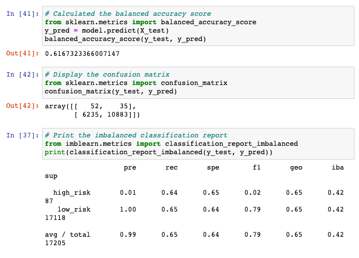
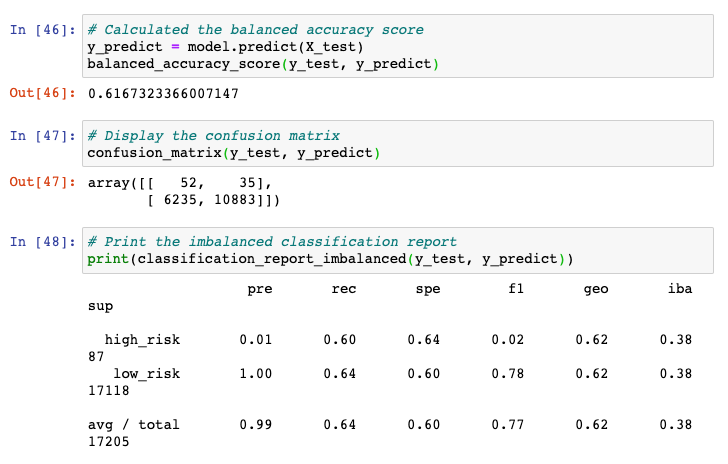
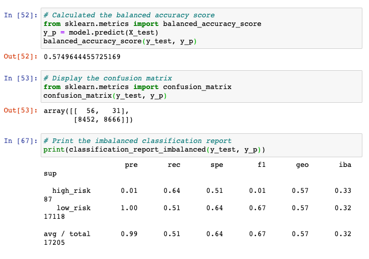
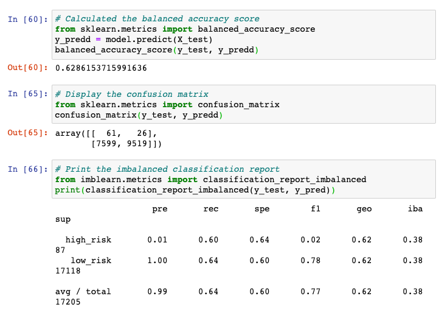
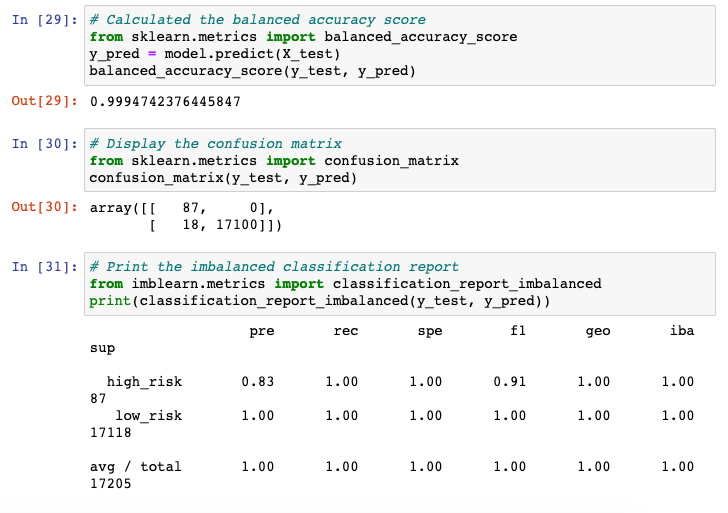
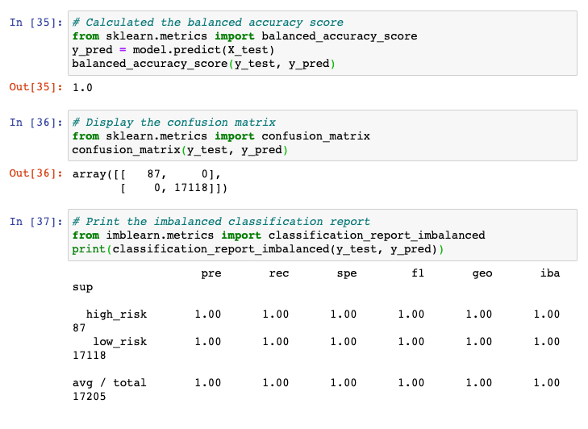

# Credit_Risk_Analysis

# Overview: 
The purpose of this analysis is to analyze factors that impact credit risk in order to predict the status of loan applications.  I used a variety of resampling methods including Naive Random Oversampling, SMOTE Oversampling, ClusterCentroids, SMOTEENN, Balanced Random Forest Classifier, and Easy Ensemble AdaBoost Classifier.  An analysis of the results of each resampling provides insights into how accurate each model will be at predicting the status of loan applications.  The combination of all of these results helps to paint a clearer picture of the predicitive power of our models. 

# Results: Using bulleted lists, describe the balanced accuracy scores and the precision and recall scores of all six machine learning models. Use screenshots of your outputs to support your results.

## Naive Random Oversampling

- Balance Accuracy Score: 0.6167323366007147
- Precision Score: 0.008271035
- Recall: 0.597701149

## SMOTE Oversampling

- Balance Accuracy Score: 0.6167323366007147
- Precision Score: 0.008271035
- Recall: 0.597701149

## ClusterCentroids

- Balance Accuracy Score: 0.5749644455725169
- Precision Score: 0.0065820404
- Recall: 0.643678161

## SMOTEENN

- Balance Accuracy Score: 0.6286153715991636
- Precision Score: 0.007963446
- Recall: 0.70114945

## Balanced Random Forest Classifier

- Balance Accuracy Score: 0.9994742376445847
- Precision Score: 0.8285714
- Recall: 1

## Easy Ensemble AdaBoost Classifier

- Balance Accuracy Score: 1
- Precision Score: 1
- Recall: 1

# Summary:
Based on this analysis, the Easy Ensemble AdaBoost Classifier is the best model to use in order to most accurately predict the loan status of an application based on credit risk.  According to the analysis, the Naive and SMOTE models produce the same results.  The second most accurate model for prediciting loan status is the Balanced Random Forest Classifier.  

